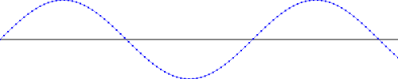

Logbuddy is logging library that doesn't require you to write explicit log statements.
It traverses graph of your dependencies and wraps them with logging proxies.
This way each invocation on service (instance, method, arguments, returned object or thrown exception) is logged without polluting your production code with log statements.

Quick example.

    class Service {
      void serve() {}

      public String toString() {
        return "Service#" + hashCode();
      }
    }
    class App {
      Service serviceA = new Service();
      Service serviceB = new Service();

      void start() {
        serviceA.serve();
        serviceB.serve();
      }

      public String toString() {
        return "App";
      }
    }

    Logger logger = thread(time(Clock.systemUTC(), invocationDepth(consoleLogger(new TextRenderer()))));
    Decorator decorator = traversing(invocationDecorator(logger));
    decorator.decorate(new App()).start();

prints

    Thread(main)  2017-07-10T08:19:15.195Z    App.start()
    Thread(main)  2017-07-10T08:19:15.204Z      Service#1521118594.serve()
    Thread(main)  2017-07-10T08:19:15.205Z      returned
    Thread(main)  2017-07-10T08:19:15.205Z      Service#1682463303.serve()
    Thread(main)  2017-07-10T08:19:15.205Z      returned
    Thread(main)  2017-07-10T08:19:15.205Z    returned

Logbuddy offers possibility to generate html logs that contain images, graphs etc.

    HtmlRenderer renderer = new HtmlRenderer() {
      public String render(Object model) {
        return model instanceof ChartModel
            ? lineChartRenderer()
                .width(500)
                .height(100)
                .color(BLUE)
                .render((ChartModel) model)
            : super.render(model);
      }
    };
    Logger logger = fileLogger(Paths.get("log.html"), renderer);
    List<Double> sinusoid = range(0, 100)
        .mapToDouble(i -> i * 0.1)
        .map(Math::sin)
        .boxed()
        .collect(toList());
    logger.log(message(chartModel(sinusoid)));

generates

More in [Documentation](doc/md/documentation.md).
